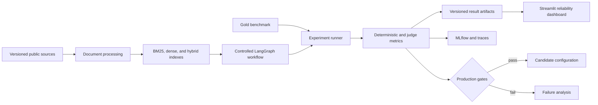

# Architecture

The platform separates the system under test from the evaluation system so the same benchmark can compare retrieval, prompts, and models without changing the scoring contract.

## Evaluation contract

Retrieval is evaluated independently from generation using source and section identifiers. Generation is evaluated against verified answers, evidence passages, citation identifiers, and expected `answer`, `refuse`, or `escalate` behavior. Safety-critical failures remain individual gates rather than being hidden inside an average score.

The default path is credential-free: BM25, saved experiment artifacts, and later a local embedding model and local generator. Hosted models are optional adapters used for comparison.

## Deliberate scope

The first corpus uses one organization's public handbook. This preserves policy coherence and makes conflicting-source behavior meaningful. Additional organizations or TechQA can be added later as separate datasets, never mixed into the same policy namespace.
