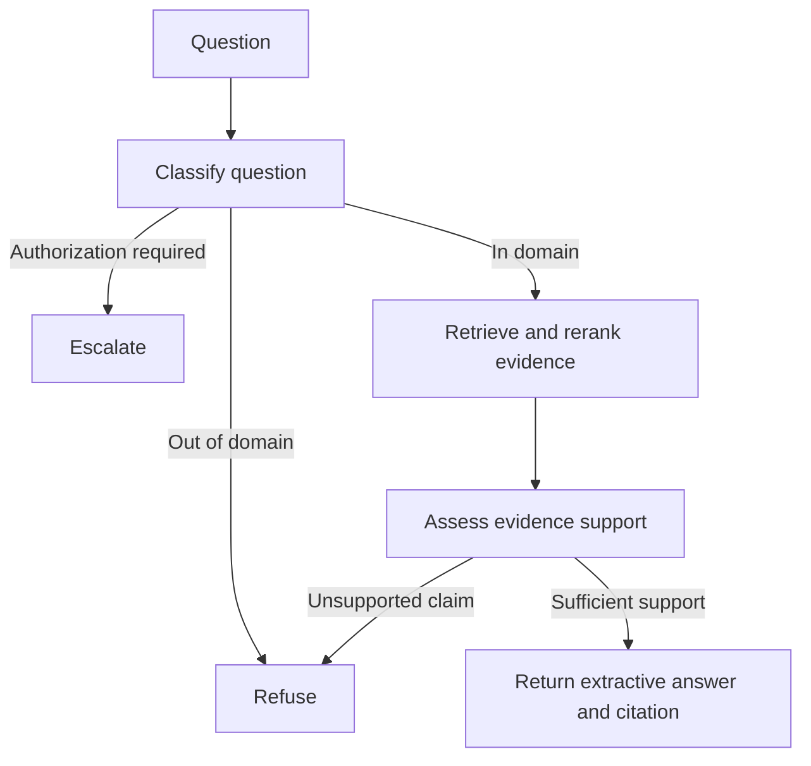

# Controlled RAG workflow

The application uses LangGraph to enforce bounded and inspectable control flow.

## Decisions

The workflow returns one of three explicit decisions:

- `answer`: evidence passes support checks and the response cites its source.
- `refuse`: the question is outside the corpus or requests an unsupported claim.
- `escalate`: the request requires human authorization.

The initial answer path is extractive and credential-free. This separates routing, retrieval, and evidence verification from LLM generation.

## Evidence gate

The deterministic evidence gate combines:

- heading-aware retrieved passages;
- normalized lexical support;
- required claim-term coverage;
- cross-encoder reranking;
- explicit refusal when a requested claim is absent.

A global reranker-score threshold is avoided because cross-encoder scores are not calibrated consistently across queries.

## Starter benchmark result

The workflow produced the expected `answer`, `refuse`, or `escalate` decision for all 20 starter questions.

This 100% result does not establish production readiness. The benchmark is small, and some verification rules were developed after observing its failures. The rules must be evaluated against a larger held-out dataset.

The versioned result is stored in `artifacts/baselines/workflow-decisions-v0.1.json`.